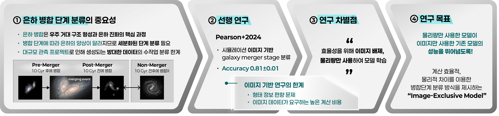
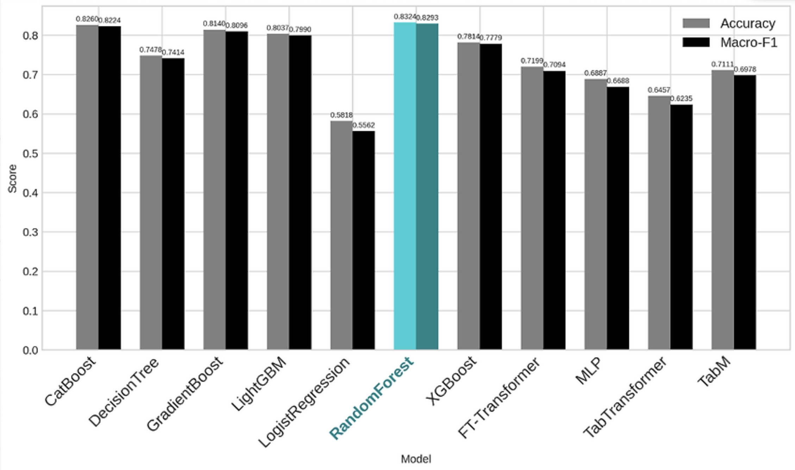
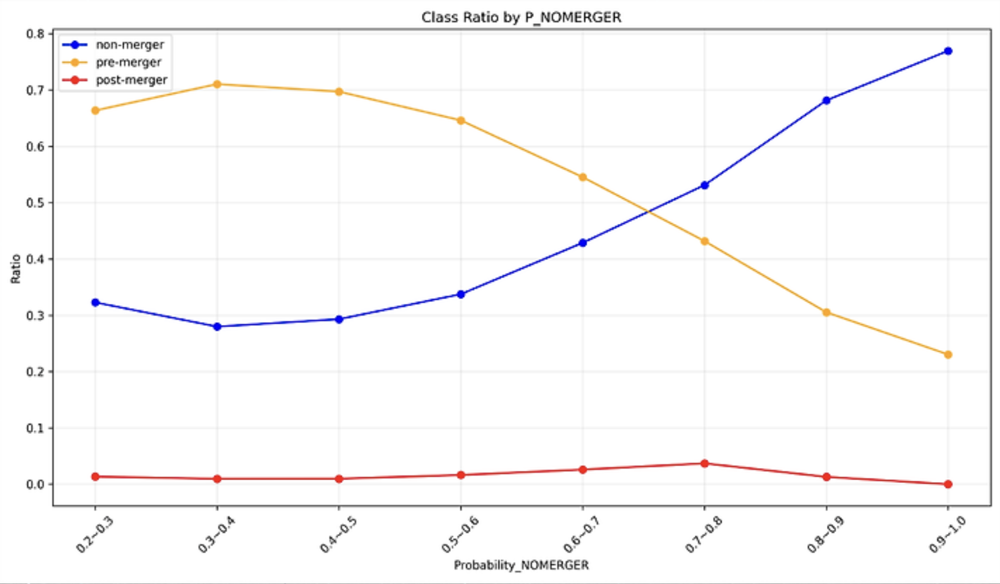

# 🌌 Image-Exclusive-Model for Galaxy Merger Classification
## : Training on Simulations and Inference on Observations

<br/>

## 🚀 프로젝트 개요

은하 병합(galaxy merger)은 우주 대규모 구조 형성과 개별 은하 진화에 핵심적인 역할을 하며,  
병합 과정에서 은하는 형태학적 변화뿐 아니라 별 생성률(SFR), 색지수, 금속함량, AGN 활성화 등  
다양한 물리적 특성 변화를 겪는다.



본 프로젝트에서는 이미지를 사용하지 않고 은하 병합을 3단계로 세분화하여 분류하며,
은하의 물리량(photometric / spectroscopic quantities)만을 활용하는  **Image-Exclusive 모델**을 제안한다.

<br/>

## 🚀 실험 데이터

```데이터는 표준화(StandardScaler) 및  KNN 기반 결측치 보정이 적용된 후 사용된다.```

<br/>

```
📊 Illustris / TNG 시뮬레이션 기반 은하 데이터 
: 학습용 시뮬레이션 생성 데이터

총 6261개

라벨 구성:
- pre : 1900개
- non : 2400개 
- post : 2000개 


📊 Illustris / TNG 시뮬레이션 기반 은하 데이터 
: 추론용 실제 관측 데이터

총 10만 개 가량
```

### 사용 feature 목록

| Feature Name           | 설명 |
|------------------------|------|
| StellarMass            | 별 질량 |
| AbsMag_g               | g 밴드 절대등급 |
| AbsMag_r               | r 밴드 절대등급 |
| AbsMag_i               | i 밴드 절대등급 |
| AbsMag_z               | z 밴드 절대등급 |
| color_gr               | 색 지수 (g − r) |
| color_gi               | 색 지수 (g − i) |
| SFR                    | 별 형성률 |
| BulgeMass              | 팽대부 질량 |
| EffectiveRadius        | 유효 반경 |
| VelocityDispersion     | 속도 분산 |
| Metallicity            | 금속도 |

### 데이터 분할 방식

- Train / Validation / Test = 7 : 2 : 1
- 5-Fold Cross Validation 적용
- 모든 실험에서 random seed = 42 고정

### 예시 데이터 칼럼 
| SubHaloID | Snapshot | Phase | StellarMass | AbsMag_g | AbsMag_r | AbsMag_i | AbsMag_z | color_gr | color_gi | SFR | BulgeMass | EffectiveRadius | VelocityDispersion | Metallicity |
|-----------|----------|-------|-------------|----------|----------|----------|----------|----------|----------|-----|-----------|-----------------|--------------------|-------------|
| 은하 고유 ID | 시뮬레이션 스냅샷 번호 | 병합 단계 라벨 (Non/Pre/Post) | 별 질량 | g 밴드 절대등급 | r 밴드 절대등급 | i 밴드 절대등급 | z 밴드 절대등급 | 색 지수 (g−r) | 색 지수 (g−i) | 별 형성률 | 팽대부 질량 | 유효 반경 | 속도 분산 | 금속도 |


<br/>

## 🚀 실험 모델
 
다양한 모델을 동일한 데이터셋과 Stratified K-Fold 교차검증 환경에서 실험하였다.
### 전체 실험 흐름
```
- Stratified K-Fold를 이용한 안정적인 학습/평가
- Classical ML ↔ Deep Learning 모델 간 성능 비교
- Accuracy 및 Macro-F1 기준으로 최적 모델 선정
```

### 실험 모델 카테고리와 종류
<p align="center">
  
</p>

<br/><br/>

## 🚀 디렉토리 구조

    SYNERGI/
    ├── data/ 📍데이터
    │   ├── DESI/ 추론용 실제 데이터
    │   └── illustris/ 학습용 시뮬레이션 데이터
    │
    ├── evaluation/📍학습 결과
    │   ├── classicalMachineLearning/
    │   ├── deepLearning/
    │   └── stacking/
    │
    ├── inference/📍추론 결과
    │   └── randomforest_final12_inference.csv
    │
    ├── model/📍모델 (용량 문제로 gitignore)
    │   ├── classicalMachineLearning/
    │   ├── deepLearning/
    │   └── stacking/
    │
    ├── src/📍소스 코드
    │   ├── data_preprocess/ 데이터 전처리 코드
    │   ├── inference/ 추론 코드 
    │   ├── SHAP/ XAI 코드
    │   └── train/ 모델 학습 코드
    │       ├── classicalMachineLearning/ 
    │       ├── deepLearning/ 
    │       └── stacking/ 
    │
    └── README.md

classicalMachineLearning, deepLearning, stacking 내부
```
├── SFR_inf_-1/ SFR 이상치를 -1로 대체한 데이터 사용
├── SFR_inf_remove/ SFR 이상치를 제외한 데이터 사용
└── final_12_datasetPhase_complete/ SFR과 BulgeMass의 계산 방식을 다르게 적용한 데이터 사용
```
SFR_inf_-1, SFR_inf_remove, final_12_datasetPhase_complete 내부
```
각 카테고리에 해당하는 모델 파일 / 모델 결과 파일
```

<br/>

## 🚀 실행 환경


### 📍How to install

    git clone <REPOSITORY_URL>


### 📍How to build

본 프로젝트는 개별 Python 스크립트 실행 방식으로 구성되어 있으며,
각 단계는 독립적으로 실행 가능하다.

    conda create -n test-env python=3.9 -y
    conda activate test-env
    pip install -r requirements.txt

conda 없는 경우

    python3 -m venv test-env
    source test-env/bin/activate
    pip install -r requirements.txt

### 📍How to test
"SFR_inf_-1" 데이터셋 기준 설명

    cd SYNERGI


### Classical Machine Learning 학습 예시

    python src/train/classicalMachineLearning/SFR_inf_-1/RandomForest.py


### Deep Learning 학습 예시

    python src/train/deepLearning/SFR_inf_-1/FT-Transformer.py


### Stacking Ensemble 학습 예시

    python src/train/stacking/lgbm_cat_xg_logreg_stacking.py


### Inference 예시

    python src/inference/randomForest_final12_inference.py

<br/>

## 🚀 사용한 오픈소스 라이브러리

- numpy
- pandas
- scikit-learn
- xgboost
- lightgbm
- catboost
- PyTorch
- shap
- rtdl-revisiting-models

모든 라이브러리는 각 라이선스를 준수하여 사용하였다.


<br/>

## 🚀 실험 결과

### ✅ 모델별 성능 비교 결과



- **Classical ML 모델들이 전반적으로 Deep Learning 모델보다 높은 성능**을 보임
- 특히 **Random Forest 모델**이
  - Accuracy **0.8324**
  - Macro-F1 **0.8293**
  로 가장 우수한 성능을 기록
- CatBoost, GradientBoost, LightGBM 역시 높은 성능을 보이며  
  물리량 기반 문제에서 Boosting 계열 모델의 강점을 확인
- Deep Learning 모델(MLP, FT-Transformer, TabTransformer)은  
  표현력은 높으나, 본 데이터 규모 및 특성에서는 성능 우위가 제한적이었음

➡️ 위 결과를 바탕으로 **Random Forest를 최종 모델로 선정**

<br/>

### ✅ 실제 관측 데이터 Inference 결과
```
선정된 Random Forest 모델을 사용하여  
실제 관측 은하 데이터에 대한 병합 단계 추론(Inference)을 수행
```

**P_NOMERGER 값 구간별로**  각 병합 단계(non / pre / post-merger)의 비율을 비교



- **non-merger 은하**의 경우  
  - P_NOMERGER 값이 높을수록 non-merger 비율이 뚜렷하게 증가
- **pre-merger / post-merger 은하**의 경우  
  - P_NOMERGER 값이 높아질수록 해당 비율이 감소
- 이는 모델이 **non-merger 확률을 일관성 있게 학습**하고 있으며,  
  병합 단계 간 물리적 차이를 확률적으로 잘 반영하고 있음을 의미

<br/>
<br/>


## 🚀 연구 결과
물리량 기반(Image-Excluded) 은하 병합 분류 모델 제안
- 이미지 기반 접근의 한계를 보완하기 위해 분광 기반 물리량만을 사용한 분류 프레임워크를 구축
- 대형 망원경 관측이나 이미지 생성 없이도 오픈 데이터만으로 모델 구성 가능

압도적인 학습 효율성 향상
- 기존 이미지 기반 모델: 학습 시간 약 5–6시간
- 제안 모델: 평균 1–2분 내 학습 완료
- 약 1800배 이상의 학습 속도 개선, 빠른 실험 반복 및 모델 탐색 가능

이미지 모델을 상회하는 분류 성능
- 이미지 기반 최신 연구(Pearson et al., 2024): Accuracy ≈ 0.81
- 본 연구(물리량만 사용): Accuracy ≈ 0.83
- 이미지 없이도 병합 단계 분류에 충분한 정보가 물리량에 내재함을 실증

높은 해석 가능성 확보
- SHAP 분석을 통해 모델이 활용하는 핵심 물리량을 정량적으로 분석
- Metallicity, StellarMass, 절대등급 계열 물리량이 주요 판별 요인으로 작동
- 기존 이미지 모델이 어려워하던 Pre-merger / Post-merger 구분이 물리량 기반에서는 명확히 분리됨

천체물리학적 의미와의 연결 가능성
- 모델이 포착한 물리적 신호가 실제 병합 과정의 물리적 변화와 일관됨을 확인
- 형태 중심 접근이 놓친 영역을 물리량 기반 정보가 효과적으로 보완함을 입증

향후 연구 및 확장성
- 향후 이미지 + 물리량을 결합한 멀티모달 병합 단계 분류 모델로 확장 계획
